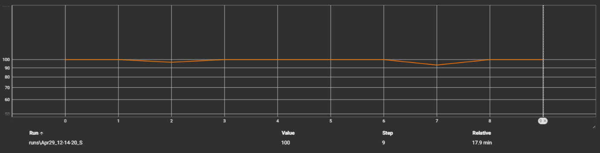
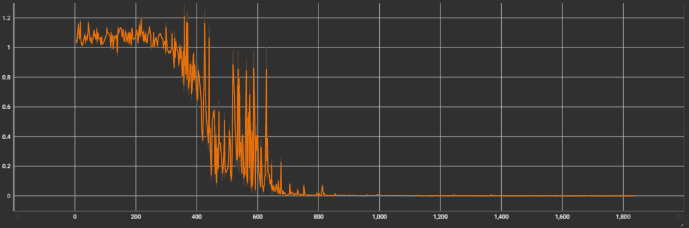
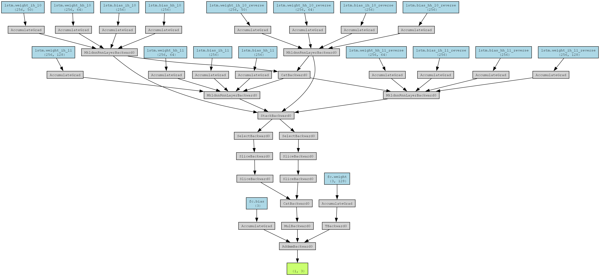

### 一个对敲击零件发出的声音来判断零件是否合格的机器学习

- MFCC 特征提取
- 基于双向 LTSM 网络
- 音频三分类问题
- 使用数据增强放大数据集

CLSAA = [0, 1, 2] # 0 松 1 正常 2 紧
CLSAA_DICT = {0: "松", 1: "正常", 2: "紧"}

### 训练和预处理

音频预处理和模型定义相关代码在 `some_tools.py`,`pre_process.py`

### 模型性能

- 对于参与训练的零件，识别准确率达到 100%
- 对于未参与训练的零件，预测准确率较稳定到 100%, 平均准确率 97%

- 最近 10 次训练测试的预测准确率 `test_train_result.py`
  - 对 100 个样本的随机交叉验证，比例 7:3

- Loss

<!-- - 模型结构 -->

<!--  -->
