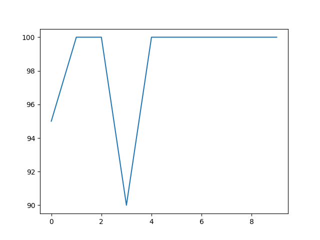

### 一个对敲击零件发出的声音来判断零件是否合格的机器学习项目

- MFCC特征提取
- 基于LTSM网络
- 音频三分类问题

CLSAA = [0, 1, 2]  # 0 松 1 正常 2 紧
CLSAA_DICT = {0: "松", 1: "正常", 2: "紧"}

音频预处理和模型训练代码在 `main_3_class_train.py` 

### 模型性能

- 对于参与训练的零件，准确率达到100%
- 对于未参与训练的零件，准确率达到95-100%

- 最近10次测试的预测准确率 `test_train_result.py`

```python
if __name__ == "__main__":
    # test_train_result()
    test_accuracy_list = []
    for i in range(10):
        pass
        accuracy = test_train_result_slpit_origian()
        test_accuracy_list.append(accuracy)

    plt.figure()
    plt.plot(test_accuracy_list)
    plt.show()
```




